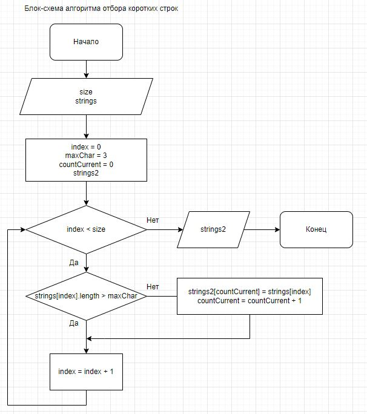

**Задача**: Написать программу, которая из имеющегося массива строк формирует массив из строк, длина которых меньше либо равна 3 символа. Первоначальный массив можно ввести с клавиатуры, либо задать на старте выполнения алгоритма.

## Этапы решения поставленой задачи.

1. Создать репозиторий на GitHub
2. Нарисовать блок-схему алгоритма (можно обойтись блок-схемой основной содержательной части, если вы выделяете ее в отдельный метод)
3. Снабдить репозиторий оформленным текстовым описанием решения (файл README.md)
4. Написать программу, решающую поставленную задачу
5. Использовать контроль версий в работе над этим небольшим проектом (не должно быть так что все залито одним коммитом, как минимум этапы 2, 3 и 4 должны быть расположены в разных коммитах)

## Шаги решения поставленой задачи.

1. Создание репозитория на GitHub.

    * Создана папка на компьютере
    * Подключена система контроля версий (GIT INIT)
    * Репозиторий направлен на GitHab.
        * git remote add origin https://github.com/Randomars/Control01.git
        * git branch -M main
        * git push -u origin main

2. Блок-схема алгоритма.

3. Создание описания решения.

4. Написание программы. 

    * Инициализация программы (dotnet new console).
    * Написаны отдельные методы для выполнения следующих функций:
        1. InputNum - ввод числа с клавиатуры.
        2. PrintString - вывод массива строк на экран.
        3. GetString1 - получение рабочей строки из общего массива данных.
        4. SelectShort - отбор коротких слов из рабочей строки.

5. Фиксирование этапов выполнения задачи (контроль версий) по мере выполнения задачи.

    * git add README.md  // Добавление файла для отслеживания.
    * git commit -m "Project created."  // Фиксирование точки.
    * git status    // Контроль изменений.
    